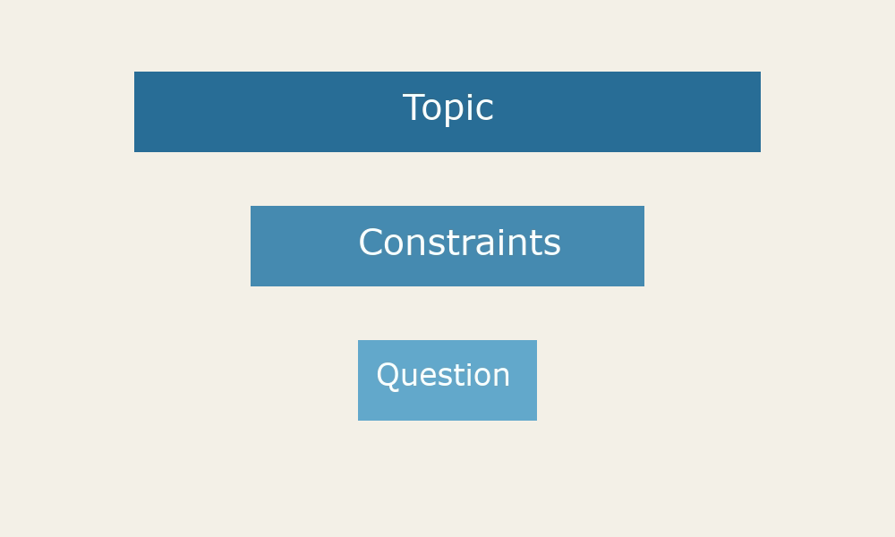

# Turning a topic into a question

- Topics are broad
- Questions are answerable
- Research starts with the question

> **Say:** Every research project begins with a topic, but a topic is not something you can research. A topic is an area of interest, like social media or climate policy. A question is something you can actually answer with evidence. In this topic we will look at how to move from one to the other, and why that move matters so much for everything that follows.

---

## From broad to narrow

> **Say:** Think of the process as a funnel. At the top sits your broad topic. Each step down the funnel adds a constraint. You might narrow by population, by place, by time period or by outcome. By the bottom of the funnel you have something small enough to study properly, but still connected to the area that interested you in the first place.

---

## Adding a population

- Who exactly?
- Students, nurses, small firms
- Be specific enough to sample

> **Say:** The first constraint is usually the population. Social media is too broad, but social media use among first year nursing students is much narrower. Being specific about who you are studying tells you who to recruit, and it tells your reader who your findings apply to. If you cannot describe your population in a sentence, the question is not ready yet.

---

## The PICO framework

- Population
- Intervention
- Comparison
- Outcome

> **Say:** A useful tool for health and social care questions is the PICO framework. PICO stands for population, intervention, comparison and outcome. Filling in each part forces you to be explicit about what you are measuring and against what. Not every question needs all four parts, but working through them quickly shows which parts of your question are still vague.

---

## Measuring the outcome

- Decide what counts as evidence
- Choose an instrument
- Likert scales, interviews, records

> **Say:** Once you know your outcome, decide how you would measure it. You might use a Likert scale in a questionnaire, a set of interviews, or existing records. If you cannot imagine any way to measure the outcome, that is a sign the question needs more work. The measurement you choose will also shape the design of the whole study.

---

## Checking your question

- Is it answerable?
- Is it focused?
- Does it still interest you?

> **Say:** Before you commit, check your question against three tests. Is it answerable with evidence you could realistically collect? Is it focused enough to finish in the time you have? And does it still interest you? A good research question passes all three, and it will guide every decision you make from here on. Write it down, share it with a colleague, and ask them to explain it back to you in their own words.
